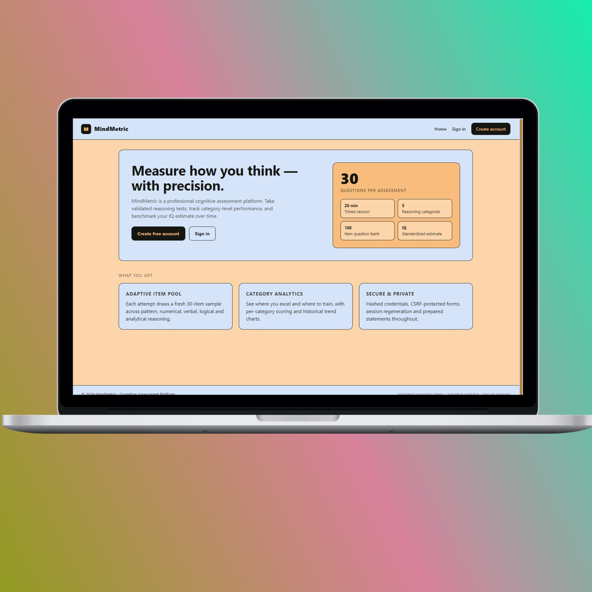
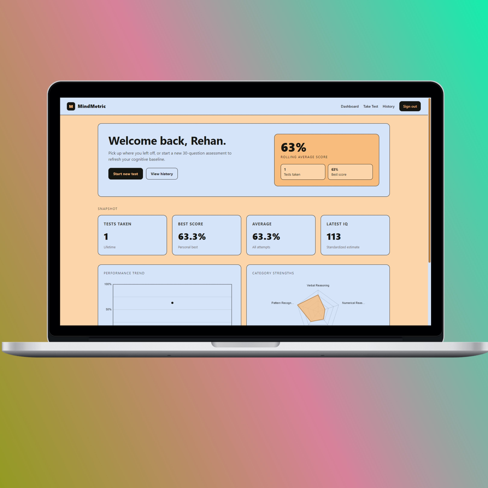
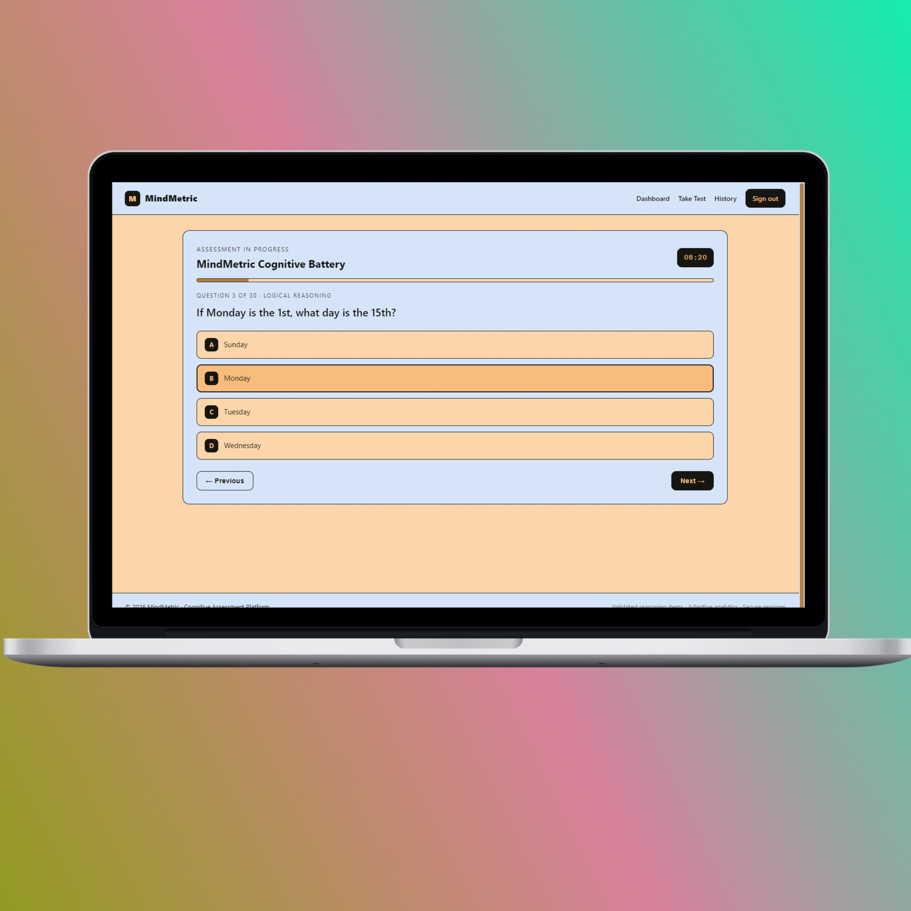
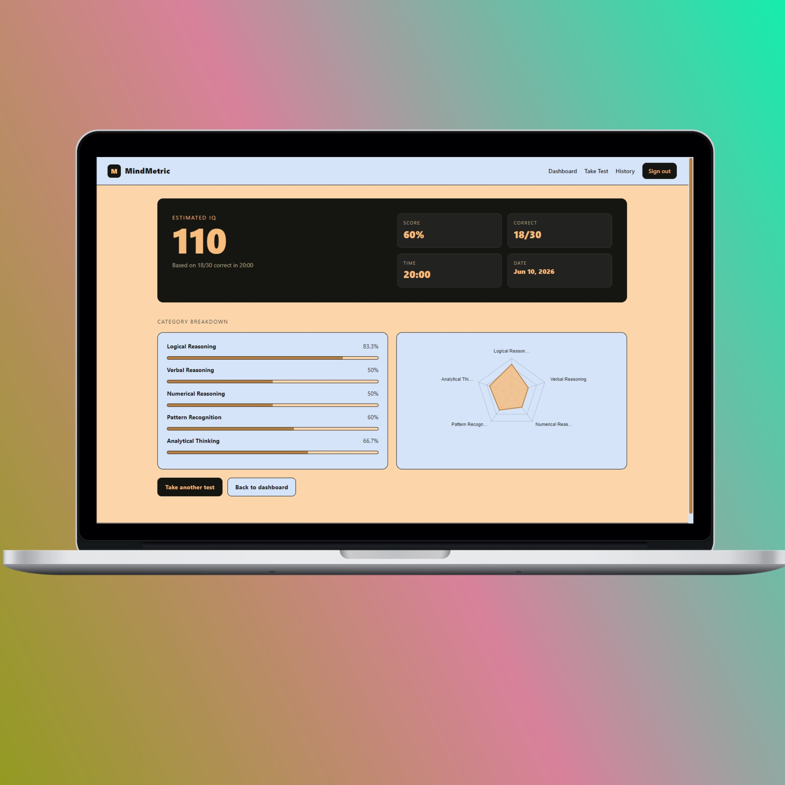

# MindMetric

Professional cognitive assessment platform built with **HTML, CSS, vanilla JavaScript, PHP, and MySQL** — no frameworks.

## Project Overview

MindMetric is a full-stack IQ testing platform. Users register, verify their email, and take 30-question timed assessments randomly drawn from a 100-item bank covering Pattern Recognition, Numerical Reasoning, Verbal Reasoning, Logical Reasoning, and Analytical Thinking. Results are scored with category breakdowns, an IQ estimate, and historical analytics.

## Features

- Email-verified registration (PHPMailer SMTP)
- Login, logout, forgot/reset password
- CSRF-protected forms, prepared statements, bcrypt hashing, secure sessions
- 100-question bank, 30-question randomized attempts
- 20-minute timer with auto-submit
- Per-category scoring + IQ estimate
- Dashboard with trend line chart and category radar (vanilla canvas)
- Full test history with detail view
- Fully responsive (desktop, tablet, mobile)
- Custom-styled scrollbar using the project palette
- Strict palette adherence: `#D6E4FA · #F8BC7C · #151511 · #B77E3F · #FCD6AA`

## Installation

1. Copy the project folder into your web root (e.g. `htdocs/mindmetric` for XAMPP).
2. Copy `.env.example` to `.env` and fill in your DB + SMTP credentials.
3. (Optional) Install PHPMailer for SMTP:
   ```bash
   composer require phpmailer/phpmailer
   ```
   If `vendor/` is absent the app falls back to PHP `mail()`.
4. Visit `http://localhost/mindmetric/` in your browser.

## Database Setup

1. Open **phpMyAdmin** and create a database named `mindmetric` (utf8mb4).
2. Select it, open the **SQL** tab, and run each file in order:
   - `sql/schema.sql` — tables
   - `sql/seed_questions.sql` — 100 IQ questions
   - `sql/seed_demo.sql` — *optional* sample analytics
3. Update `.env` with your `DB_*` values.

## Email Setup

In `.env`:
```
MAIL_HOST=smtp.gmail.com
MAIL_USERNAME=your@gmail.com
MAIL_PASSWORD=your_app_password
MAIL_PORT=587
MAIL_FROM_NAME=MindMetric
MAIL_FROM_EMAIL=no-reply@mindmetric.local
```
For Gmail use an **App Password** (not your account password).

## Screenshots






## Folder Structure

```
mindmetric/
├── .env.example
├── .gitignore
├── README.md
├── index.php
├── register.php
├── verify.php
├── login.php
├── logout.php
├── forgot-password.php
├── reset-password.php
├── dashboard.php
├── test.php
├── results.php
├── history.php
├── api/
│   ├── save-answer.php
│   └── submit-test.php
├── assets/
│   ├── css/style.css
│   └── js/{main,test,charts}.js
├── config/config.php
├── includes/
│   ├── auth.php
│   ├── csrf.php
│   ├── db.php
│   ├── header.php
│   ├── footer.php
│   └── mailer.php
└── sql/
    ├── schema.sql
    ├── seed_questions.sql
    └── seed_demo.sql
```

## Security Notes

- Prepared statements for every query
- Bcrypt password hashing
- CSRF token on every state-changing form/endpoint
- Session ID regeneration on login
- HttpOnly + SameSite session cookies
- Email verification gate on login
- Output escaping via `sanitize()` helper

## License

MIT — use freely for educational and personal projects.
